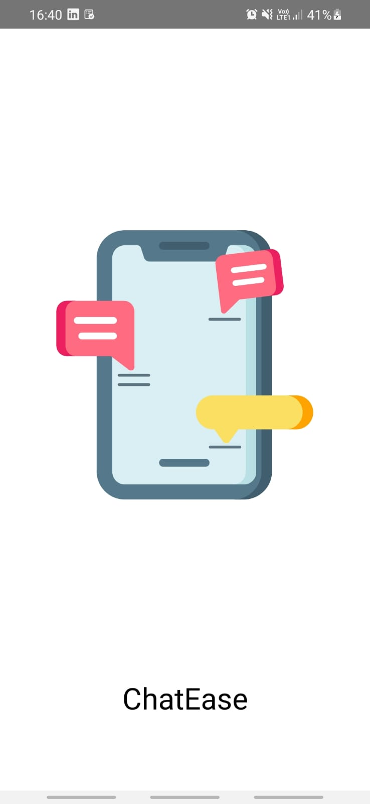
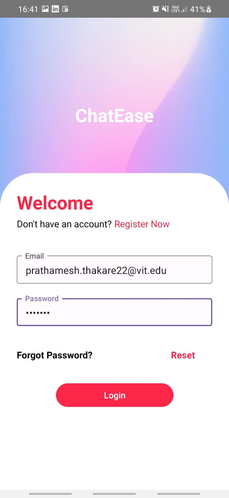
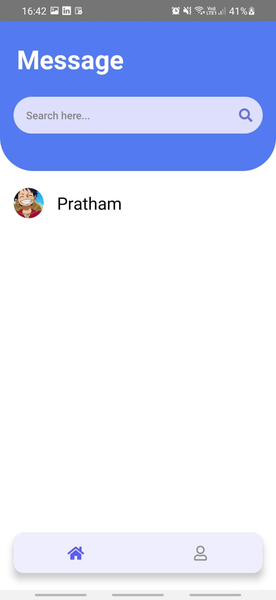
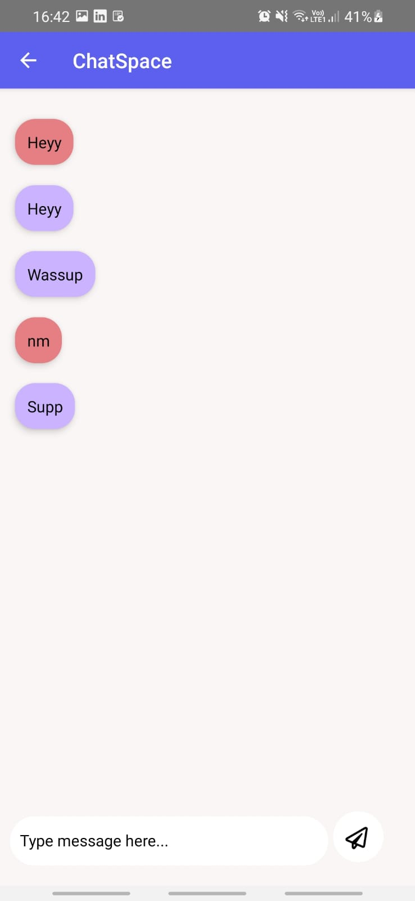

# ChatEase Chatting Android Application
Welcome to ChatEase! This app is designed to help users easily connect and chat with other users from around the world. With a user-friendly interface and a range of features, this app makes it easy for you to start chatting with others in no time.

<p align="center">


</p>

## Table of Contents
<ol>
<li>Features</li>
<li>Getting Started</li>
<li>Usage</li>
<li>Contributing</li>
</ol>


## Features
* Easy registration: The app allows users to quickly register and create an account using their email.
* Chatting: Users can easily initiate conversations with other users by sending them messages in real-time.
* Clean UI: Clean and user friendly UI helps user to smoothly navigate through application.

<p align="center">


</p>

## Getting Started
To run this app, follow the steps below:
<ol>
<li>Clone the repository, open cmd in the desired folder and type:</li>

```
git clone https://github.com/SheRights/SheRights-Application.git
```

<li>Navigate to the project's root directory.</li>
<li>Install the project dependencies using:</li>

```
npm install
```

</ol>

## Configuration
ChatEase uses Firebase for authentication and database. To use Firebase in the app, you will need to create a new Firebase project and add the configuration details to the project. Here's how:
<ol>
<li>Create a new Firebase project on the Firebase Console.</li>
<li>Navigate to the project's settings and click on the "Add Firebase to your app" button.</li>
<li>Copy the Firebase configuration object.</li>
<li>Download Google-Services file and place it in your project.</li>
</ol>

## Running the Application
To run the application on your device or emulator, run the following command:
<ol>
<li>Open command prompt in your root directory and run:</li>

```
npx react-native start
```

<li>Open command prompt in your root directory and run:</li>

```
npx react-native run-android
```

</ol>
This will start the React server and open the React Developer Tools in your prompt. From here, you can choose to run the app on a physical device, emulator and start the test runner and run all the tests for the application.

## Usage
<ol>
<li>Open the ChatEase app on your Android device.</li>
<li>Select one of the user to chat with.</li>
<li>In ChatSpace write your message and send it your friend in real time.</li>
<li>Browse through different accounts available on platform and connect with them easily.</li>
</ol>

## Contributing
If you want to contribute to the NewsPilot app, you can:

* Open an issue to report a bug or suggest a feature.
* Fork the repository, make changes, and create a pull request.
